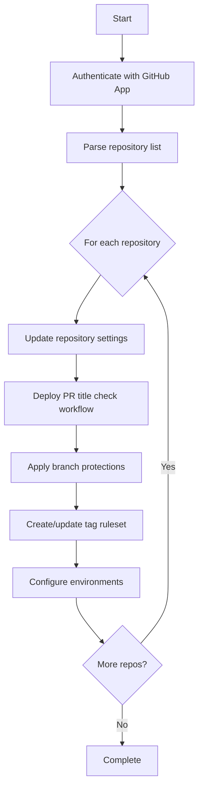

# Apply Repo Settings - GitHub Actions Workflow

## Overview

This GitHub Actions workflow automates the configuration of standardized repository settings, branch protections, tag protections, and deployment environments across multiple repositories in your organization.

## Features

- ✅ **Repository Settings**: Configure merge strategies and branch cleanup policies
- 🔒 **Branch Protection**: Apply protection rules to `main` and `dev` branches
- 🏷️ **Tag Protection**: Protect release tags matching `*RC*` and `*V*` patterns
- 🌍 **Environment Management**: Set up `dev`, `test`, and `prod` environments with deployment controls
- 📝 **PR Title Validation**: Automatically deploy PR title check workflows to target repositories

## Prerequisites

### Required Secrets

Configure the following secrets in your repository or organization:

| Secret | Description |
|--------|-------------|
| `APP_ID` | GitHub App ID with necessary permissions |
| `APP_PEM` | GitHub App private key (PEM format) |

### GitHub App Permissions

Your GitHub App must have the following permissions:

- **Repository permissions:**
  - Administration: Read & Write
  - Contents: Read & Write
  - Environments: Read & Write
  - Metadata: Read
  - Pull requests: Read & Write
- **Organization permissions:**
  - Members: Read

### Required Files

Ensure the following file exists in your repository:
```
.github/workflows/templates/pr-title-check.yml
```

This template will be deployed to target repositories.

## Usage

### Manual Trigger

1. Navigate to **Actions** → **Apply Repo Settings**
2. Click **Run workflow**
3. Fill in the required inputs:

#### Input Parameters

| Parameter | Required | Type | Default | Description |
|-----------|----------|------|---------|-------------|
| `repos` | ✅ Yes | string | - | Comma-separated list of repository names (e.g., `repo1, repo2, repo3`) |
| `force_recreate` | No | boolean | `false` | Force recreation of existing rulesets and environments |

### Example Usage

**Basic execution:**
```
repos: my-app, my-service, my-library
force_recreate: false
```

**Force recreation:**
```
repos: legacy-app
force_recreate: true
```

## What Gets Configured

### 1. Repository Settings

The workflow applies the following repository-level settings:

- ✅ Enable squash merging
- ✅ Auto-delete head branches after merge
- ❌ Disable auto-merge
- 📝 Squash merge commit title: PR title
- 📝 Squash merge commit message: PR body

### 2. Branch Protection Rules

Protection is applied to `main` and `dev` branches:

| Setting | Value |
|---------|-------|
| **Linear history** | Required |
| **Admin enforcement** | Not enforced |
| **Code owner reviews** | Required |
| **Last push approval** | Required |
| **Conversation resolution** | Required |
| **Status checks** | `validate-pr-title` (strict) |
| **Force pushes** | Disabled |
| **Commit signatures** | Required |

**Note:** If the `dev` branch doesn't exist, it will be automatically created from `main`.

### 3. Tag Protection Ruleset

A repository ruleset named **"Tag Protection"** is created to protect tags matching:
- `*RC*` (Release Candidates)
- `*V*` (Version tags)

Protected operations:
- ❌ Creation (restricted)
- ❌ Updates (restricted)
- ❌ Deletion (restricted)

**Bypass Actor:** GitHub App (ID: `2271772`) can bypass these restrictions for automated releases.

### 4. Deployment Environments

Three environments are created with different protection policies:

#### Development Environment (`dev`)

| Setting | Value |
|---------|-------|
| **Reviewers** | None |
| **Admin bypass** | Enabled |
| **Deployment branches** | `dev` branch only |

#### Test Environment (`test`)

| Setting | Value |
|---------|-------|
| **Reviewers** | `ias-team-admin` team |
| **Admin bypass** | Enabled |
| **Deployment branches** | `main` branch only |

#### Production Environment (`prod`)

| Setting | Value |
|---------|-------|
| **Reviewers** | `ias-team-admin` team |
| **Admin bypass** | Enabled |
| **Deployment branches** | Tags matching `*RC*` or `*V*` |

### 5. PR Title Validation Workflow

The workflow deploys a `pr-title-check.yml` file to each repository's `.github/workflows/` directory, ensuring consistent PR naming conventions.

## Workflow Logic



## Configuration

### Modifying Protected Branches

To change which branches receive protection, update the `defaultBranches` array:

```javascript
const defaultBranches = ['main', 'dev', 'staging']; // Add or remove branches
```

### Modifying Approving Teams

To change which teams can approve deployments, update the `teamSlugs` array:

```javascript
const teamSlugs = ["ias-team-admin", "security-team"]; // Add team slugs
```

### Modifying Tag Patterns

To protect different tag patterns, update the ruleset conditions:

```javascript
"include": [
    "refs/tags/*RC*",
    "refs/tags/*V*",
    "refs/tags/release-*"  // Add custom patterns
]
```

## Error Handling

The workflow implements robust error handling:

- **404 errors**: Skips non-existent repositories
- **Non-200 responses**: Logs errors and continues to next repository
- **Missing branches**: Automatically creates `dev` from `main`
- **Existing resources**: Respects existing configurations unless `force_recreate=true`

## Logging

The workflow provides detailed console output:

```
--------------------------------------------------------
Applying settings to pm-org-1/my-app...
✅ Updated repository settings for pm-org-1/my-app, Response status: 200
✅ Created pr-title-check.yml in pm-org-1/my-app, Response status: 201
✅ Branch protection applied to pm-org-1/my-app on branch main, Response status: 200
✅ Tag ruleset created, Response status: 201
✅ Recreated environment 'dev' with protection rules
✅ Completed applying settings to pm-org-1/my-app
--------------------------------------------------------
```

## Troubleshooting

### Common Issues

#### "Context access might be invalid: APP_ID, APP_PEM"

**Solution:** Ensure secrets are properly configured:
```bash
# Verify secrets exist (run in repository settings or via CLI)
gh secret list
```

#### "Failed to get team ID for ias-team-admin"

**Solution:** Verify:
1. Team exists in the organization
2. Team slug is correct (lowercase, hyphenated)
3. GitHub App has `members:read` organization permission

#### "Failed to create tag ruleset: Resource protected by organization SAML enforcement"

**Solution:** Authenticate with SAML SSO:
```bash
gh auth login --with-token < token.txt
```

#### "Required status check 'validate-pr-title' not found"

**Solution:** Ensure the PR title check workflow has run at least once before applying branch protection.

## Security Considerations

### Commit Signatures Required

Branch protection requires commit signing. Ensure all contributors have configured GPG or SSH signing:

```bash
# Configure GPG signing
git config --global commit.gpgsign true
git config --global user.signingkey YOUR_GPG_KEY_ID

# Or configure SSH signing (GitHub recommended)
git config --global gpg.format ssh
git config --global user.signingkey ~/.ssh/id_ed25519.pub
```

### GitHub App vs Personal Access Token

This workflow uses a GitHub App for authentication, which provides:
- ✅ More granular permissions
- ✅ Higher rate limits
- ✅ Better audit trail
- ✅ Organization-level scope

## Customization Examples

### Example 1: Add a Staging Environment

```javascript
const environments = [
    // ... existing environments
    {
        name: 'staging',
        reviewers: approving_teams,
        allow_admin_bypass: true,
        deployment_branch_policy: { protected_branches: false, custom_branch_policies: true },
        deployment_branch_policies: [
            {
                type: 'branch',
                name: 'main'
            }
        ]
    }
];
```

### Example 2: Add Additional Status Checks

```javascript
required_status_checks: {
    strict: true,
    contexts: [
        'validate-pr-title',
        'lint',
        'test',
        'security-scan'
    ]
}
```

### Example 3: Require Multiple Reviewers

```javascript
required_pull_request_reviews: {
    required_approving_review_count: 2,  // Add this line
    require_code_owner_reviews: true,
    require_last_push_approval: true
}
```

## Limitations

- ⚠️ Workflow only processes repositories that exist and are accessible
- ⚠️ Cannot create repositories; only configures existing ones
- ⚠️ Hardcoded GitHub App ID for tag protection bypass
- ⚠️ Requires `main` branch to exist for creating `dev` branch

## Best Practices

1. **Test First**: Run on a test repository before applying to production repos
2. **Use Force Recreate Sparingly**: Only use when you need to update existing configurations
3. **Monitor Logs**: Review workflow logs to ensure all settings applied correctly
4. **Gradual Rollout**: Apply to repositories in batches rather than all at once
5. **Document Changes**: Keep track of which repositories have been configured

## Contributing

To modify this workflow:

1. Update the workflow file: `.github/workflows/apply-repo-settings.yml`
2. Test changes on a non-critical repository
3. Update this documentation to reflect changes
4. Commit and push to `main` branch

## Support

For issues or questions:
1. Check the workflow run logs in Actions tab
2. Review error messages in console output
3. Verify GitHub App permissions and secrets
4. Contact DevOps team for assistance

## Version History

| Version | Date | Author   |Changes |
|---------|------|----------|--------|
| 1.0 | 2025-11-11 | Praveena Mundolimoole|Initial version with branch, tag, and environment protection |

---

**Maintained by:** DevOps Team  
**Last Updated:** November 11, 2025
