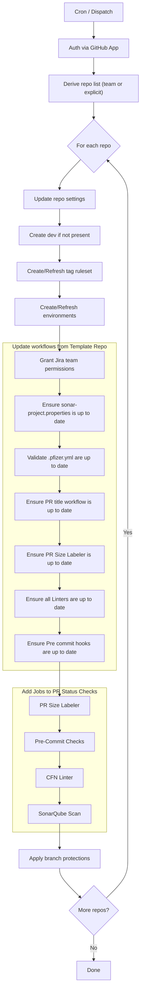

# Apply Repo Settings Workflow

Short, precise overview of the scheduled & on-demand governance workflow for GitHub repositories under `pm-org-1`.

## What It Does
| Area | Action |
|------|--------|
| Repo settings | Enables squash merge, deletes merged branches, standardizes squash commit title/message |
| Team scope | Optionally targets all repos of a VOX team (`vox_team`) or a provided list (`repos`) |
| Branches | Creates `dev` if missing; protects `main` & `dev` (linear history, code owners, last-push approval, signed commits, PR title check) |
| Tags | Active ruleset protects `*RC*` & `*V*` (create/update/delete restricted; GitHub App bypass) |
| Environments | Configures `dev`, `test`, `prod` with branch/tag deployment policies & reviewers |
| Compliance files | Ensures `.pfizer.yml` required keys; manages `sonar-project.properties` project key |
| Workflow seeding | Installs/updates `.github/workflows/pr-title-check.yml` |
| Team permissions | Grants `atlassian-team-service-account` push access |

## Repository Settings Applied
The workflow enforces these repository-level settings on every targeted repo:

| Setting | Value / Behavior |
|---------|------------------|
| Squash merge allowed | Enabled (`allow_squash_merge: true`) |
| Squash commit title | Uses PR title (`PR_TITLE`) |
| Squash commit message | Uses PR body (`PR_BODY`) |
| Auto-delete merged branches | Enabled (`delete_branch_on_merge: true`) |
| Auto-merge | Disabled (`allow_auto_merge: false`) |
| Merge strategy normalization | Encourages linear history via branch protection (no rebase/merge commits enforced by policy + required linear history) |
| Commit signatures | Attempted enable per protected branch (commit signature protection API) |
| Protected branches | `main`, `dev` (created if missing) with required reviews & status checks |
| Tag ruleset | Protects `*RC*` & `*V*` tags (create/update/delete restricted) with GitHub App bypass |
| PR status check | Ensures `validate-pr-title` workflow present and required before merge |
| Team permission | Adds `atlassian-team-service-account` with `push` rights |
| Required config files | Ensures `.pfizer.yml` contains mandated keys; sets/updates `sonar-project.properties` project key |

Note: If any setting is already in desired state, it is left unchanged unless `force_recreate` is true (applies to environments & tag rulesets).

## Triggers
| Type | Details |
|------|---------|
| Manual | `workflow_dispatch` with inputs below |
| Scheduled | Daily cron `0 0 * * *` |

## Inputs
| Input | Type | Default | Purpose |
|-------|------|---------|---------|
| `vox_team` | string | `ias-team-admin` | Team whose repos to manage (used if `apply_to_all_repos=true`) |
| `apply_to_all_repos` | boolean | `true` | Override `repos` and target all repos for `vox_team` |
| `repos` | string | (empty) | Comma list of repos when not applying to all |
| `force_recreate` | boolean | `false` | Recreate rulesets & environments if they already exist |

Precedence: `apply_to_all_repos=true` ignores `repos`.

## High-Level Flow

## Required Assets
| Item | Path / Name |
|------|-------------|
| Secrets | `APP_ID`, `APP_PEM` |
| Workflow template | `.github/workflows/templates/pr-title-check.yml` |

## Minimal Troubleshooting
| Symptom | Quick Fix |
|---------|-----------|
| Missing team error | Confirm team slug exists & App has members:read |
| PR status check missing | Let PR title workflow run once before enforcing protection |
| Tag ruleset failure | Verify App ID and repo rulesets feature enabled |
| Commit signature errors | Ensure contributors have GPG or SSH signing configured |

## Fast Customization
| Goal | Edit |
|------|------|
| Add branch protection to `staging` | Append `'staging'` to `defaultBranches` array in script |
| Add more status checks | Extend `required_status_checks.contexts` |
| Extra approving team | Add slug to `teamSlugs` list |
| New environment `staging` | Add object to `environments` array |

## Safety Notes
Use `force_recreate` sparingly; it deletes & rebuilds environments and tag rulesets. All operations skip 404 repos gracefully.

## Version
| Date | Ver | Notes |
|------|-----|-------|
| 2025-11-13 | 1.1 | Short form README; added team-wide targeting & compliance file summary |

Maintained by DevOps Team • Last updated: 2025-11-13